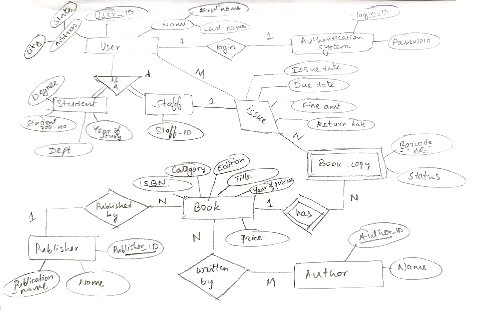

# Library DBMS (Python + PostgreSQL)

Simplified subset of the library ER diagram: three tables, **Publisher**, **Book** and **Book_copy**,
linked by the "Published by" and "has" relationships.
Left out as out of scope: User (with the Student/Staff ISA), Authentication System, Issue, and Author.

## ER diagram
Full ER diagram of the library system (rotated and brightened; the drawing itself is unchanged).



## Files
| File | What it does |
|---|---|
| `schema.sql` | Creates the 3 tables with their keys and constraints (drops them first, so it is re-runnable) |
| `data.sql` | Inserts the sample data (empties the tables first, so it is re-runnable) |
| `db.py` | Python connection helper; credentials come from environment variables |
| `schema.py` | Runs `schema.sql` then `data.sql` through Python |

## Run
With Python:
```bash
pip install -r requirements.txt
export PGDATABASE=library_db PGUSER=... PGPASSWORD=...   # Windows cmd: set PGDATABASE=library_db  (etc.)
python schema.py
```

Or directly in psql / pgAdmin's Query Tool:
```
\i schema.sql
\i data.sql
```

## Schema
| Table | Columns | Keys |
|---|---|---|
| `publisher` | publisher_id, name, publication_name | PK publisher_id |
| `book` | isbn, title, category, edition, price, year_of_publication, publisher_id | PK isbn; FK publisher_id -> publisher |
| `book_copy` | isbn, barcode_no, status | PK (isbn, barcode_no); FK isbn -> book ON DELETE CASCADE |

Extra constraints: `book.publisher_id` is `NOT NULL` (every book has a publisher) and `price >= 0`.

## Sample data
6 publishers (2 with no books), 9 books (2 with no copies, one with a NULL price, one with a NULL edition),
15 copies with mixed status (available / issued / lost).

## Try it in psql or pgAdmin
Referential integrity: each of these is rejected by PostgreSQL.
```sql
INSERT INTO book_copy VALUES ('0000000000000', 1, 'available');                 -- no such book
INSERT INTO book (isbn, title, publisher_id) VALUES ('9999999999999', 'X', 99); -- no such publisher
INSERT INTO book_copy VALUES ('9780133970777', 1, 'available');                 -- duplicate (isbn, barcode_no)
DELETE FROM publisher WHERE publisher_id = 1;                                    -- publisher still has books
```

Delete rule: deleting a book removes its copies (wrapped in a transaction and undone):
```sql
BEGIN;
DELETE FROM book WHERE isbn = '9780134685991';
SELECT COUNT(*) FROM book_copy WHERE isbn = '9780134685991';   -- 0
ROLLBACK;
```

Queries:
```sql
-- 1. JOIN: each book with its publisher (title is in book, publisher name is in publisher)
SELECT b.title, b.price, p.name AS publisher
FROM book b JOIN publisher p ON p.publisher_id = b.publisher_id;

-- 2. Aggregate: copies per book
SELECT b.title, COUNT(*) AS copies
FROM book b JOIN book_copy c ON c.isbn = b.isbn
GROUP BY b.isbn, b.title;

-- 3. Filter: no join needed, every column is in book
SELECT title, price FROM book WHERE category = 'Databases' AND price > 50;

-- 4. LEFT JOIN: books per publisher, including publishers with none (6 rows; INNER JOIN gives 4)
SELECT p.name, COUNT(b.isbn) AS books
FROM publisher p LEFT JOIN book b ON b.publisher_id = p.publisher_id
GROUP BY p.publisher_id, p.name;

-- 5. Books with no copies
SELECT b.title
FROM book b LEFT JOIN book_copy c ON c.isbn = b.isbn
WHERE c.isbn IS NULL;
```

## Viva talking points
- **Composite PK on book_copy:** it is a weak entity. `barcode_no` (1, 2, 3...) only identifies a copy
  *within one book*, so the key is `(isbn, barcode_no)`; the isbn part is also the FK to the owner.
- **CASCADE on book_copy->book, not on book->publisher:** a copy has no meaning without its book,
  so deleting a book removes its copies. A publisher deletion should never silently wipe out
  the catalogue; the default `NO ACTION` forces you to reassign or delete books first.
- **Integrity is enforced by the database:** the bad inserts above are rejected by PostgreSQL itself,
  whichever program sends them.
- **LEFT JOIN vs INNER JOIN:** query 4 keeps publishers with no books. `COUNT(b.isbn)` gives 0 for them
  because COUNT(column) skips NULLs (COUNT(*) would give 1).
- **NULLs in filters:** query 3 (`price > 50`) leaves out the Databases book with a NULL price, because
  comparing NULL gives "unknown", not true.
- **Re-runnable data.sql:** `TRUNCATE` and all inserts are inside `BEGIN ... COMMIT`, so running it twice gives
  the same data, and if any insert fails nothing changes.
- **Connections:** `db.connection()` commits on success, rolls back on an error, and always closes the
  connection in `finally`. (psycopg2's own `with conn:` only ends the transaction; it does not close.)
- **Security:** database credentials come from environment variables, not from the code.
